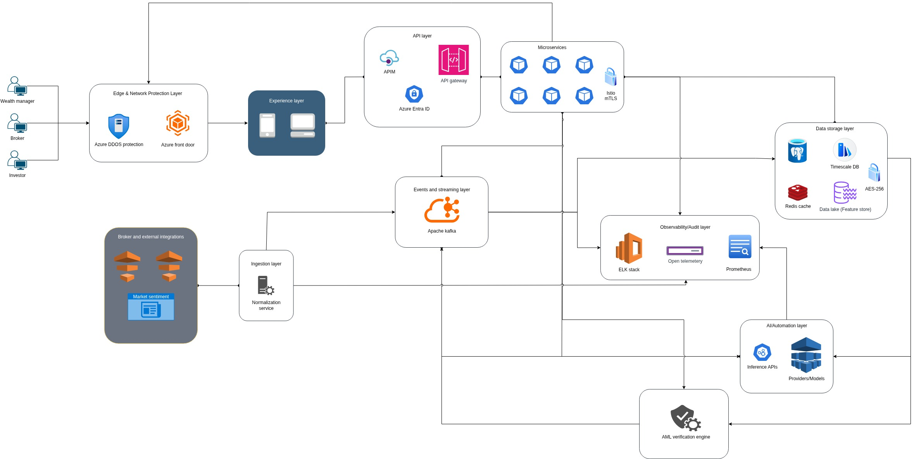

# Smart Portfolio Intelligence Platform - Axiom

A cloud-native, event-driven, microservices-based platform designed for real-time data ingestion, analytics, and AI-driven intelligence.  
Built for scale, observability, and multi-client access across web and mobile.

---

## 1. High-Level Architecture Overview

The platform is organized into **clearly separated layers**, each with a single responsibility:

- Experience (Web & Mobile)
- API & Identity
- Core Microservices
- Ingestion & Normalization
- Events & Streaming
- Data Storage
- AI / Automation
- Observability & Audit
- External Integrations

This separation avoids tight coupling, enables independent scaling, and supports future expansion (new channels, new data providers, new AI models).

---

## 2. Experience Layer

### Purpose
User-facing applications that consume platform APIs.

### Tech Stack
- **Web**: Next.js (React, App Router)
- **Mobile**: React Native
- **API Communication**: REST + GraphQL
- **Auth**: OpenID Connect via Azure Entra ID

### Responsibilities
- User authentication & authorization
- Portfolio dashboards
- Real-time updates
- Zero business logic beyond presentation

> The experience layer is **stateless** and never talks directly to databases or brokers.

---

## 3. API Layer

### Purpose
Single controlled entry point into the platform.

### Tech Stack
- **Azure API Management (APIM)**
- **Azure Entra ID**

### Responsibilities
- Authentication & token validation
- Rate limiting & throttling
- Request validation
- API versioning
- Routing to microservices
- Audit logging

---

## 4. Core Microservices Layer

### Purpose
Central place for all domain logic.

### Tech Stack
- **Node.js (TypeScript)**
- **Framework**: Express
- **Containerized**: Docker
- **Orchestration**: Kubernetes (AKS)
- **Inter-service comms**:
  - gRPC
  - Kafka (async, event-driven)

### Responsibilities
- Portfolio management
- Market data processing
- User preferences
- Risk calculations
- Permissions & entitlements

### Design Principles
- Stateless services
- Horizontal scalability
- Event-driven whenever possible
- Minimal inter-service communication (Avoid unless necessary)

---

## 5. Broker & External Integrations Layer

### Purpose
Integration with third-party data providers and brokers.

---

## 6. Ingestion & Normalization Layer

### Purpose
Convert messy external data into a clean internal format.

### Tech Stack
- **Node.js ingestion services**
- Schema validation (Zod)
- Kafka producers

### Responsibilities
- Normalize external payloads
- Enrich data with metadata
- Reject invalid data early
- Publish clean events to Kafka

> This layer protects the rest of the system from bad data.

---

## 7. Events & Streaming Layer

### Purpose
Decouple producers and consumers using an event-driven backbone.

### Tech Stack
- **Apache Kafka**
- Kafka topics per domain

### Responsibilities
- Real-time event streaming
- Event replay
- Fan-out to multiple consumers

### Typical Events
- Market price updates
- Portfolio changes
- User activity
- AI inference triggers

---

## 8. Data Storage Layer

### Purpose
Persist and serve data optimized for different workloads.

### Tech Stack
- **PostgreSQL** – primary transactional database
- **TimescaleDB** – time-series data (prices, metrics)
- **Redis** – caching & ephemeral state

### Usage Pattern
| Storage | Use Case |
|------|--------|
| PostgreSQL | Users, portfolios, transactions |
| TimescaleDB | Market ticks, historical trends |
| Redis | Caching, rate limits |

---

## 9. AI / Automation Layer

### Purpose
Advanced intelligence and automation.

### Tech Stack
- Inference APIs (Python)
- External AI providers or internal models
- Async processing via Kafka

### Responsibilities
- Portfolio recommendations
- Risk scoring
- Pattern detection
- Automated alerts & actions

### Design Notes
- Failures must never block core flows
- Results are stored and replayable

---

## 10. Observability & Audit Layer

### Purpose
Visibility, debugging, and compliance.

### Tech Stack
- **OpenTelemetry** – unified instrumentation
- **Prometheus** – metrics
- **ELK Stack** – logs

### What’s Tracked
- Request latency
- Error rates
- Kafka lag
- Service health
- Security & audit trails

---

## 11. Monorepo Setup (Turborepo)

### Tooling
- **Turborepo**
- Shared TypeScript configs
- Shared linting & formatting

### Benefits
- Shared contracts
- Faster builds
- Consistent tooling
- Easier refactoring

---

## 12. Key Architectural Decisions

- Event-driven over synchronous coupling
- API Gateway
- No shared databases
- Observability is not optional
- AI must never block core flows
- Experience layer stays dumb
- Physically seperate deployments with gitops
- PII is Pseudonymized

---

## 14. Summary

This architecture is:
- Scalable
- Observable
- Secure
- Cloud-native
- Ready for real-time + AI workloads

---